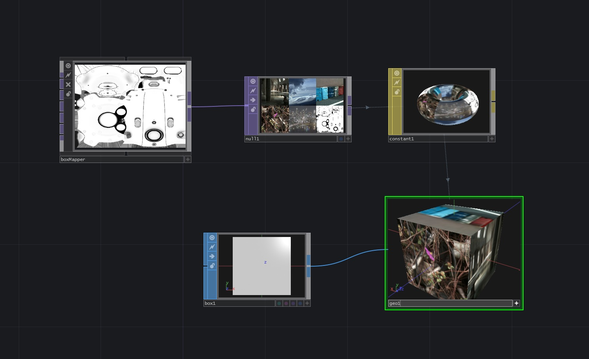
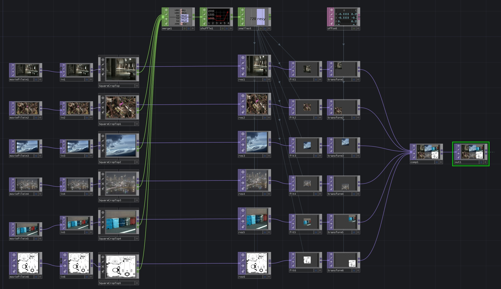

# TD-BoxMapper
A simple TouchDesigner network that creates a texture that maps neatly to a cubic box.

This network will take 6 TOP inputs and crop each image seperately to a square. Each texture is scaled to the size of the smallest, then composited into a new texture containing all 6. The texture can then be used as a material texture for mapping on any cubic box SOP.

